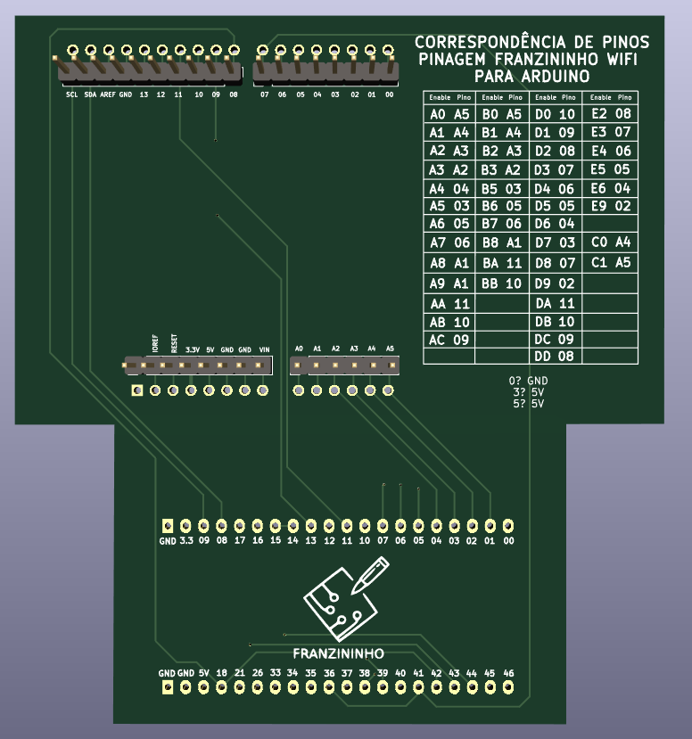

## Adaptador para Arduino - Placa Laboratório de Sistemas Embarcados e IoT

## O que é este projeto?

Este projeto é um adaptador que permite a conexão da placa Arduino Uno com a placa [Laboratório de Sistemas Embarcados e IoT](https://github.com/Franzininho/laboratorio-SEIoT-Franzininho-Wifi) através de uma correspondência entre os pinos do Arduino Uno e a pinagem da Franzininho Wifi (placa utilizada no projeto da placa de laboratório). Para utilizar o adaptador basta conectá-lo ao Arduino como um shield e então conectar o adaptador na placa.

## Codificação dos pinos de ativação

Como a placa [Laboratório de Sistemas Embarcados e IoT](https://github.com/Franzininho/laboratorio-SEIoT-Franzininho-Wifi) conta com um sistema de codificação dos pinos de ativação dos periféricos, foi preciso codificar esses pinos. A codificação escolhida tem dois algorismos sendo que o primeiro indica a funcionalidade do pino e o segundo indica uma numeração do pino.

O código de cada pino está impresso ao lado dele na placa principal e para facilitar a utilização do adaptador foi impresso nele a correspondência entre o pino do Arduino e o código de ativação na placa. Essa correspondência também pode ser acessada [clicando aqui](./informacoes/mapeamento.md).

Além disso, também foi desenvolvida uma biblioteca para uso em conjunto com o placa que permite o uso dos códigos dos pinos de ativação dentro da programação. [Clique aqui](https://github.com/Franzininho/biblioteca-laboratorioFW_ARDUNO) para acessar a **biblioteca laboratorioFW_ARDUNO.**

## Como o projeto foi desenvolvido?

O projeto foi desenvolvido com o software [KiCad 7](https://www.kicad.org/). Esse software é aberto e está disponível para Linux, MacOS e Windows.

---

#### Feito por [LelePG](https://github.com/LelePG)
